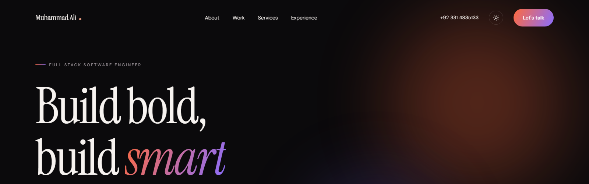
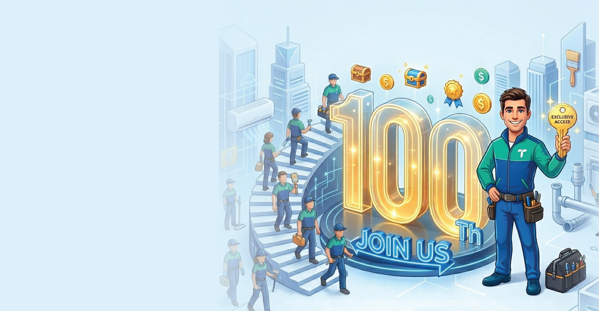
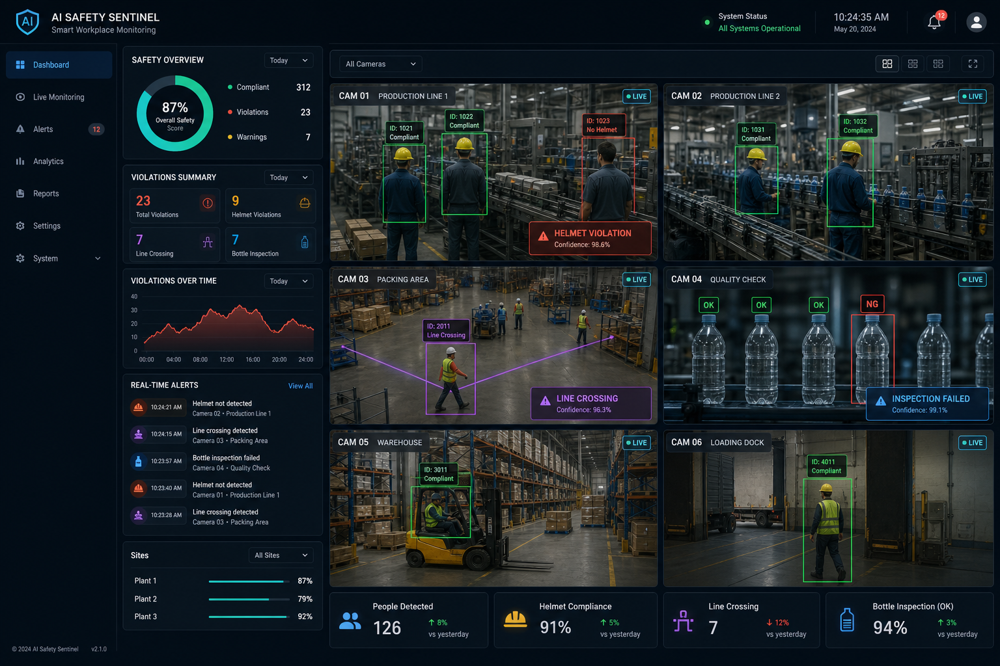
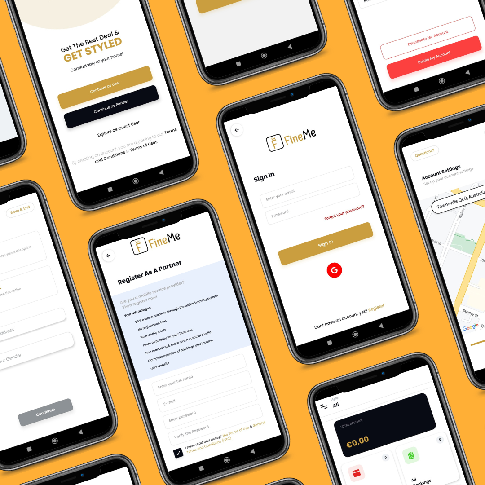

<div align="center">



### 3D Developer Portfolio

An editorial, typography-driven portfolio site with a persisted dark/light theme,<br/>
animated WebGL scenes, and a cursor-tracking project index.

[](https://muhammadali-dev-seven.vercel.app)
[](https://react.dev/)
[](https://vitejs.dev/)
[](https://docs.pmnd.rs/react-three-fiber)
[](https://tailwindcss.com/)
[](https://www.framer.com/motion/)
[](https://vitest.dev/)
[](#license)

**[View live site →](https://muhammadali-dev-seven.vercel.app)**

[Report a bug](https://github.com/Rappidz456/Portfolio_3D/issues) · [Request a feature](https://github.com/Rappidz456/Portfolio_3D/issues) · [Get in touch](mailto:mohammadali6918773@gmail.com)

</div>

<br/>

**Live:** [muhammadali-dev-seven.vercel.app](https://muhammadali-dev-seven.vercel.app)

## Overview

This repo is the source for my personal developer portfolio — built to read like an editorial
magazine spread rather than a template dashboard. It pairs a typography-first layout with
real-time WebGL (a cursor-reactive hero rig, a particle depth field, procedurally textured
technology spheres, and a rotating contact globe), all wrapped in a theme system that's applied
before first paint to avoid a light/dark flash.

It also doubles as a working example of a production-shaped React + Three.js codebase: content
is data-driven (`src/constants`), animation is centralized behind a couple of small primitives
(`SectionWrapper`, `utils/motion.js`), and the contact form is wired to a real email pipeline via
EmailJS with env-based config, an inline spinner, and toast feedback.

## Features

- 🌓 **Dark/light theme** — defaults to dark, persisted to `localStorage`, applied pre-paint (no FOUC)
- 🎬 **Editorial hero** — masked word reveal over an animated 3D rig that tracks the cursor
- ✨ **Scroll-driven motion** — section reveals via a shared `SectionWrapper` HOC, with reduced-motion support throughout
- 🗂️ **Project index** — cursor-tracking preview on desktop, inline images on touch devices
- 🪐 **3D technology spheres** — procedurally textured planets rendered in a single shared canvas
- 🏷️ **Canvas-rendered brand logos** — drawn with Path2D from Simple Icons data (`src/constants/techIcons.js`, CC0-1.0) instead of icon-font bloat
- 📜 **Typographic experience index** — career history laid out as an index, not a timeline widget
- ✉️ **Live contact form** — EmailJS-backed, env-driven config, submit spinner, toast notifications
- 🌍 **Rotating contact globe** — lazy-loaded R3F scene, mounted only when scrolled into view

## Tech stack

| Layer | Stack |
| --- | --- |
| **Framework** | React 18, Vite 5, React Router |
| **3D / WebGL** | Three.js, `@react-three/fiber`, `@react-three/drei` |
| **Styling** | Tailwind CSS, CSS custom properties for theming |
| **Motion** | Framer Motion |
| **Forms / Email** | EmailJS |
| **Tooling** | Vitest, ESLint, Prettier |

<details>
<summary><strong>Full skill set (shown in the site's Tech section)</strong></summary>

<br/>

| Category | Skills |
| --- | --- |
| Languages | JavaScript, TypeScript, Python, SQL |
| Frameworks & Libraries | React Native, Next.js, React.js, Node.js, Express.js, FastAPI, Redux, Zustand, Context API, Vue, Tailwind CSS, Three.js |
| Data & Backend | PostgreSQL, Firebase, REST APIs, Axios |
| Engineering & Delivery | Git, JIRA, Agile Development, Docker, CI/CD Pipelines, System Monitoring, Debugging |
| Testing & Quality | Unit Testing, Performance Tuning, Accessibility Best Practices |
| GenAI & Agents | OpenAI API, GPT-4o, Responses API, OpenAI Agents SDK, Anthropic, Claude Code |

</details>

## Featured work

Projects shown on the live site's index — each links to its source or store listing.

<table>
<tr>
<td width="50%" valign="top">
<br/>
<strong><a href="https://www.tasky.ae/">Tasky</a></strong><br/>
AI-powered UAE services marketplace — web and mobile. Post tasks or browse verified professionals across cleaning and maintenance, with auth, real-time updates, and company onboarding.<br/>
<sub>Next.js · React Native · Node.js</sub>
</td>
<td width="50%" valign="top">
<br/>
<strong>AI Surveillance System</strong><br/>
Real-time safety and compliance dashboard — helmet non-compliance, line-crossing, and bottle inspection detection, backed by a Node.js/Python stack for live video analytics.<br/>
<sub>Next.js · FastAPI · Python</sub>
</td>
</tr>
<tr>
<td width="50%" valign="top">
<br/>
<strong><a href="https://play.google.com/store/apps/details?id=com.link.reminder">ReminderLink</a></strong><br/>
Health-focused reminder app on Google Play for medication doses and appointments — recurring schedules, custom alerts, completion tracking, cross-device sync.<br/>
<sub>React Native · Push Notifications · Mobile</sub>
</td>
<td width="50%" valign="top">
<br/>
<strong>FineMe</strong><br/>
Salon booking app with dual customer/partner roles — browse by location, services, and ratings, with end-to-end booking and business management.<br/>
<sub>React Native · Firebase · Mobile</sub>
</td>
</tr>
</table>

## Experience snapshot

Also reflected on the site's Experience section (`src/constants/index.js`):

| Role | Company | Period |
| --- | --- | --- |
| Software Engineer | Wisdom IT Solutions | Jul 2025 – Present |
| Software Engineer | Jarvis Technologies | Aug 2024 – Jun 2025 |
| Mobile Application Developer | Cyber Advance Solutions | Jan 2022 – Jul 2024 |

## Project structure

```text
src/
  components/        # UI sections + Loader + ScrollProgress
  components/canvas/ # R3F scenes (CanvasShell, HeroScene, ParticleField, TechSpheres, GlobeScene)
  context/            # Theme and toast providers
  config/             # Env-driven config (EmailJS)
  constants/          # Portfolio content — edit here to update copy
  hooks/              # Shared React hooks
  hoc/                # SectionWrapper animation HOC
  utils/              # Motion variants + form helpers
```

## Getting started

### Prerequisites

- [Node.js](https://nodejs.org/) 18+
- npm

### Installation

```bash
git clone https://github.com/Rappidz456/Portfolio_3D.git
cd Portfolio_3D
npm install
cp .env.example .env
npm run dev
```

Open the URL printed by Vite (usually `http://localhost:5173`).

### Environment variables

Copy `.env.example` to `.env` and set your own [EmailJS](https://www.emailjs.com/) values:

| Variable | Description |
| --- | --- |
| `VITE_EMAILJS_SERVICE_ID` | EmailJS service ID |
| `VITE_EMAILJS_TEMPLATE_ID` | EmailJS template ID |
| `VITE_EMAILJS_PUBLIC_KEY` | EmailJS public key |

Never commit real secrets — `.env` is gitignored.

### Scripts

| Command | Description |
| --- | --- |
| `npm run dev` | Start the Vite development server |
| `npm run build` | Production build → `dist/` |
| `npm run preview` | Preview the production build |
| `npm run lint` | Run ESLint |
| `npm run format` | Format source with Prettier |
| `npm run test` | Run unit tests (Vitest) |

## Customizing content

Edit `src/constants/index.js` to update navigation, services, technologies, experience,
testimonials, and projects — the UI is entirely data-driven from that file.

Both theme palettes are defined as RGB-channel CSS variables in `src/index.css` (under `:root`
and `[data-theme="dark"]`) and surfaced to Tailwind in `tailwind.config.cjs`, so utilities like
`bg-paper` and `text-accent` follow the active theme automatically. UI images and icons live
under `src/assets`.

## Contact

<div align="left">

[](https://muhammadali-dev-seven.vercel.app)
[](mailto:mohammadali6918773@gmail.com)
[](https://github.com/Rappidz456)

</div>

## License

Customized for personal use.

